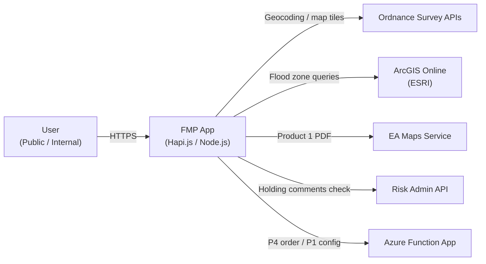
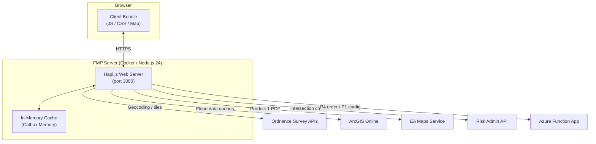
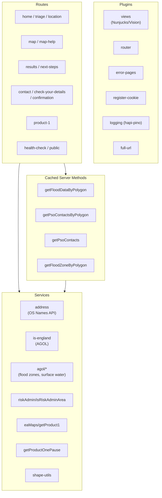
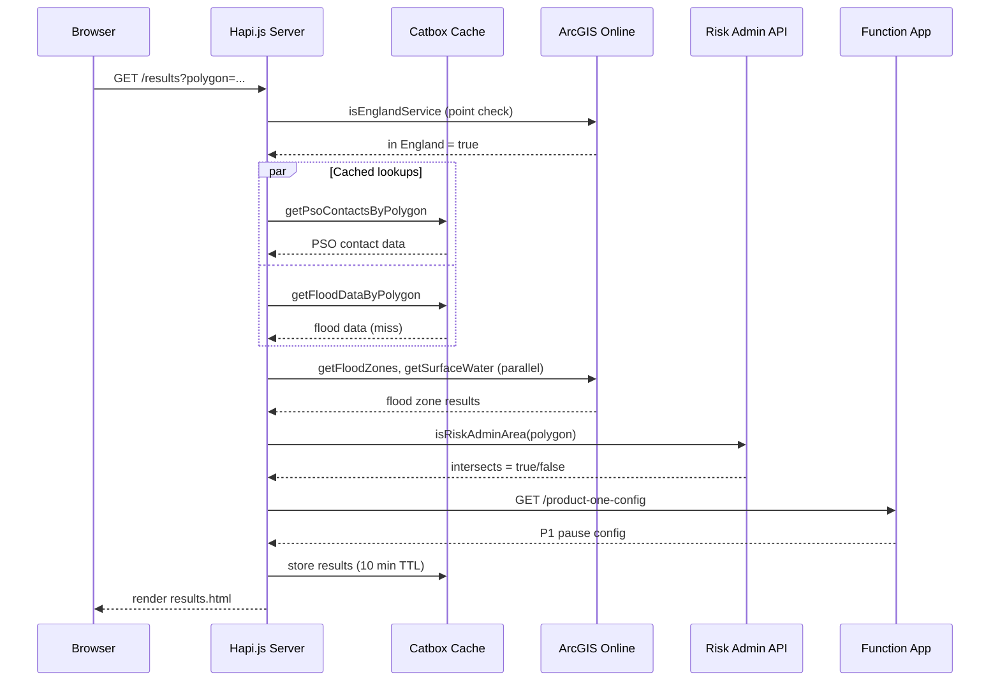
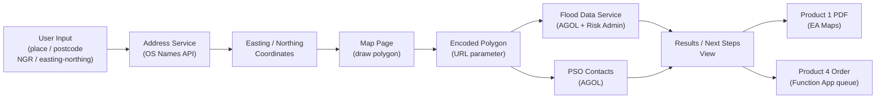
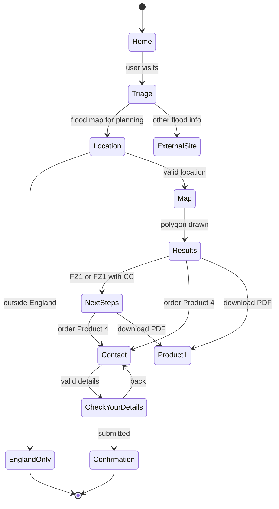
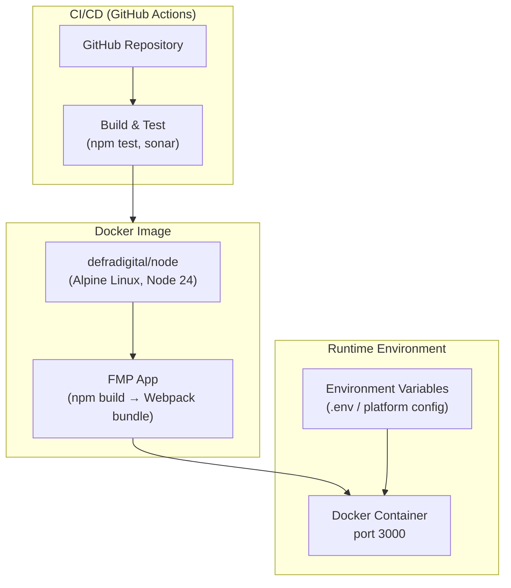

# Flood Map for Planning (FMP) Application Architecture

## 1. Executive Summary

The Flood Map for Planning (FMP) application is a public-facing and internal web service operated by DEFRA that enables users — primarily planning applicants and internal Environment Agency (EA) staff — to determine flood risk for a given site in England. Users search for a location, draw a site boundary polygon on an interactive map, and receive a flood zone classification. From there they can download a Product 1 (PDF map) or order a Product 4 (formal flood risk assessment report).

The application is a server-rendered web application built on **Hapi.js** (Node.js), using **Nunjucks** templates and the **GOV.UK Frontend** design system. Client-side interactivity is provided by a **Webpack**-bundled bundle that integrates **ArcGIS JS SDK** and **@defra/flood-map** for the interactive mapping experience. All flood data is sourced from **ArcGIS Online (AGOL)** feature services, with additional integrations to Ordnance Survey APIs, an EA Maps ArcGIS Server, a Risk Admin API, and an Azure Function App.

---

## 2. Technology Stack

| Layer | Technology |
|---|---|
| Runtime | Node.js ≥ 24.10.0 |
| Web framework | Hapi.js v21 |
| Templating | Nunjucks (via @hapi/vision) |
| Client-side bundler | Webpack 5 |
| Client-side mapping | @defra/flood-map, ArcGIS JS SDK (@arcgis/core), Mapbox GL Draw |
| Client-side UI | React 19 / Preact 10 |
| CSS | Sass, GOV.UK Frontend |
| HTTP client | Axios, @hapi/h2o2 (proxy), @hapi/wreck |
| Schema validation | Joi |
| Caching | @hapi/catbox-memory (in-process) |
| Session / cookies | @hapi/yar, @hapi/cookie |
| Logging | hapi-pino |
| Containerisation | Docker (defradigital/node Alpine base image) |
| CI/CD | GitHub Actions, SonarCloud |
| Package manager | npm |

---

## 3. System Context

The FMP App sits at the centre of the FMP service ecosystem, consuming several external APIs and delegating downstream processing to companion services.

**External actors and systems:**

| System | Role |
|---|---|
| **User** | Public applicant or internal EA/LLFA officer |
| **Ordnance Survey APIs** | Geocoding (OS Names), map tile service (OS Maps), postcode lookup |
| **ArcGIS Online (AGOL)** | Authoritative flood zone feature layers (rivers/sea, climate change, surface water, contacts, local authority, is-England boundary) |
| **EA Maps Service** | ArcGIS Server GP service that generates the Product 1 PDF |
| **Risk Admin API** (fmp-riskadmin-api) | Checks whether a polygon intersects an area under holding comments |
| **Azure Function App** | Provides Product 1 pause/maintenance window config; receives Product 4 order requests via a queue |

---

## 4. Container Architecture

There is a single deployable container. The **in-memory Catbox cache** (10-minute TTL, 10 KB max) stores costly AGOL query results keyed by polygon geometry so that repeated results/next-steps navigations are served without extra API calls.

---

## 5. Component Breakdown

### Plugins

| Plugin | Purpose |
|---|---|
| `views` | Registers Nunjucks as the template engine via `@hapi/vision`; configures view paths, GOV.UK Frontend paths, and global template context (app version, GA account, service name) |
| `router` | Aggregates and registers all route modules with the Hapi server |
| `error-pages` | `onPreResponse` lifecycle extension; maps Boom errors to 404 or 500 Nunjucks views |
| `register-cookie` | Declares two session cookies — `p4Request` (deduplication) and `p4Customer` (name/email pre-fill) — using `@hapi/cookie` with base64-JSON encoding |
| `logging` | Configures structured JSON request logging via `hapi-pino`; redacts auth headers/cookies; ignores `/healthcheck` and static assets |
| `full-url` | Decorates each request with a helper to reconstruct the absolute URL |

### Routes (selected)

| Path | Method(s) | Description |
|---|---|---|
| `/` | GET | Home page |
| `/triage` | GET, POST | Directs user to flood map or external flood information |
| `/location` | GET, POST | Location search; resolves place/postcode/NGR/BNG to easting-northing |
| `/map` | GET | Interactive ArcGIS map for polygon drawing |
| `/results` | GET | Flood risk results for a drawn polygon |
| `/next-steps` | GET | Guidance page (shown for FZ1 or climate change only areas) |
| `/contact` | GET, POST | Collects applicant name and email for Product 4 order |
| `/check-your-details` | GET, POST | Review screen before submitting Product 4 |
| `/confirmation` | GET | Order confirmation with reference number |
| `/product-1` | POST | Proxies to EA Maps Service to stream a Product 1 PDF |
| `/defra-map/config` | GET | Serves map configuration JSON (AGOL URLs, OS account, version) |
| `/health-check` | GET | Returns app version and git revision as JSON |

### Cached Server Methods

Hapi server methods allow results to be memoised in Catbox. The four registered methods share these cache settings:

- **Cache store:** `FMFP` (Catbox Memory)
- **TTL:** 10 minutes (`expiresIn: 600000`)
- **Stale-while-revalidate:** re-fetches in the background after 9 minutes
- **Generate timeout:** 20 s (flood data), 10 s (PSO contacts)
- **Cache key:** `JSON.stringify(polygon)`

| Method | Description |
|---|---|
| `getFloodDataByPolygon` | Runs four AGOL queries in parallel (flood zones, climate change zones, surface water, surface water climate change) plus a Risk Admin API check |
| `getPsoContactsByPolygon` | Fetches Planning Support Officer contact details for the polygon centroid from AGOL |
| `getPsoContacts` | Point-based PSO lookup (used by confirmation page) |
| `getFloodZoneByPolygon` | Simplified flood zone lookup used by check-your-details |

### Services

| Service | External dependency | Description |
|---|---|---|
| `address` | OS Names API, OS Places API | Geocodes place names/postcodes to easting-northing; reverse-geocodes easting-northing to postcode |
| `is-england` | AGOL | Point-in-polygon check against the England boundary layer |
| `agol/getFloodZones` | AGOL | Queries Rivers and Sea flood zones (FZ2 / FZ3) for a polygon |
| `agol/getFloodZonesClimateChange` | AGOL | Climate change (CCP1) flood zone overlay |
| `agol/getSurfaceWater` | AGOL | Surface water risk band for a polygon |
| `agol/getSurfaceWaterClimateChange` | AGOL | Surface water climate change depths |
| `agol/getContacts` | AGOL | Customer team (PSO) and local authority contacts |
| `agol/getEsriToken` | AGOL OAuth | Manages an `ApplicationCredentialsManager` token with automatic expiry and refresh |
| `riskAdmin/isRiskAdminArea` | Risk Admin API | HTTP GET with polygon; returns `{ intersects: boolean }` |
| `eaMaps/getProduct1` | EA Maps ArcGIS Server | Submits polygon and parameters to a GP service; polls and streams back the resulting PDF |
| `getProductOnePause` | Function App | Checks if Product 1 downloads are currently paused (maintenance window) |
| `shape-utils` | — | Encodes/decodes polygon strings, calculates area, centroid, validates bounds |

---

## 6. Request Lifecycle — Results Page

The `/results` page is the most complex route; it illustrates the full server-side processing pipeline.

**Key notes:**

- On a cache miss, `getFloodDataByPolygon` fans out to four AGOL feature service calls **in parallel** plus one Risk Admin API call.
- The AGOL `esriRequest` layer automatically refreshes OAuth tokens via `getEsriToken` (backed by `@esri/arcgis-rest-request`'s `ApplicationCredentialsManager`) before each request when the token is within 5 seconds of expiry.
- The `onPreResponse` lifecycle hook appends `cache-control: no-cache` and `Strict-Transport-Security` headers to every response.

---

## 7. Data Flow

**Polygon encoding:** The drawn polygon is encoded as a URL-safe string by `shape-utils.encodePolygon` (using `@mapbox/polyline`) and carried as a query parameter (`encodedPolygon`) through the results → contact → check-your-details → confirmation flow. On each page the server decodes it back to coordinate pairs for AGOL queries. This keeps the server stateless between pages.

**Flood zone classification logic:**

| AGOL result | Zone | Level |
|---|---|---|
| FZ3 feature intersects | 3 | High |
| FZ2 feature intersects (no FZ3) | 2 | Medium |
| No features | 1 | Low |

---

## 8. User Journey

**Application type switching:** The `fmpAppType` environment variable (`public` | `internal`) controls whether the "Order Product 4" button is always visible (internal) or only shown when `contactData.useAutomatedService === true` (public).

---

## 9. Deployment Architecture

- The `Dockerfile` uses a **two-stage build** (`development` and `production` targets) both rooted on `defradigital/node:2.9.0-node24.10.0` (Alpine).
- The build stage runs `npm ci --omit dev` then `npm run build` (Webpack) to produce the static client bundle into `dist/`.
- A `version.js` file is generated at build time from `BUILD_VERSION` and `GIT_COMMIT` build arguments; this is surfaced on the `/health-check` route.
- The container exposes port 3000. All configuration is injected via environment variables validated at startup by a Joi schema in `config/schema.js`.
- PM2 configuration is present (`config/pm2.json`) for non-Docker execution environments.

---

## 10. Configuration Management

All configuration is centralised in `config/index.js` and validated at startup against a Joi schema. Key sections:

| Config group | Notable keys |
|---|---|
| `server` | `port` (default 3000) |
| `ordnanceSurvey` | `osNamesUrl`, `osMapsUrl`, `osSearchKey`, `osClientId`, `osClientSecret` |
| `agol` | `clientId`, `clientSecret`, `serviceUrl`, plus ~14 AGOL FeatureServer endpoint paths |
| `eamaps` | `serviceUrl`, `product1User`, `product1Password`, `product1EndPoint`, `tokenEndPoint` |
| `riskAdminApi` | `url` |
| `functionAppUrl` | Base URL for the Azure Function App |
| `placeApi` | OS Places API URL |

Environment-aware endpoint construction is handled in `config/index.js`: `_NON_PRODUCTION` suffixes are stripped from all AGOL paths when `ENV=prod`, and the surface water depth layer name follows a slightly different pattern in production (`0mm` → `0_mm`).

---

## 11. Authentication and Session

### AGOL OAuth
The AGOL services are protected by OAuth 2 client credentials. `server/services/agol/getEsriToken.js` manages a singleton `ApplicationCredentialsManager` instance (from `@esri/arcgis-rest-request`). Tokens are proactively refreshed 5 seconds before expiry. Concurrent refresh requests are deduplicated by saving the in-flight `refreshTokenPromise`.

### EA Maps token
`server/services/eaMaps/getEAMapsToken.js` manages a separate credential flow for the EA ArcGIS Server that generates Product 1 PDFs.

### Session cookies
Two `httpOnly` session cookies are registered via `@hapi/cookie`:

| Cookie | Purpose |
|---|---|
| `p4Request` | Stores submitted polygon keys to prevent duplicate Product 4 orders within a browser session |
| `p4Customer` | Pre-fills name and email on the contact form if the user navigates back |

Both cookies use `base64json` encoding, `Strict-Transport-Security`-safe settings, and are session-scoped (no `ttl`).

---

## 12. Client-Side Architecture

The client bundle is compiled by **Webpack 5** (`webpack.config.mjs`) from the `client/` directory. Three entry points are produced:

| Entry point | Output | Purpose |
|---|---|---|
| `client/js/core.js` | `core.js` | Cookie consent banner (minimal JS) |
| `client/js/map/index.js` | `map.js` | Full interactive ArcGIS map |
| `client/sass/application.scss` | `application.css` | GOV.UK Frontend + custom styles |

The map bundle (`map.js`) imports the `@defra/flood-map` React component (or the local `defra-map` git submodule when `build_map_as_submodule=true`). It initialises:

- **Base maps** — Ordnance Survey vector tile layers (via OS Maps API and OS account key)
- **Flood zone layers** — Vector tile layers from ArcGIS Online (`vtLayers.js`)
- **Drawing tool** — Mapbox GL Draw for polygon creation with a max area of 3,000,000 m²
- **Layer slider** — Opacity slider to compare present-day and climate change layers
- **Info panel** — Fetched from `/defra-map/info-panel` (server-rendered HTML injected into the map component)
- **Tokens** — Fetches ESRI and OS tokens from `/defra-map/config` at page load

---

## 13. Caching Strategy

| Layer | Mechanism | TTL | Scope |
|---|---|---|---|
| Server-side flood data | Catbox Memory (`FMFP` cache) | 10 min (stale after 9) | Process-local; keyed by polygon string |
| Server-side PSO contacts | Catbox Memory (`FMFP` cache) | 10 min (stale after 9) | Process-local; keyed by polygon string |
| AGOL OAuth token | In-memory singleton | refresh at expiry | Process-local |
| HTTP responses to browser | `cache-control: no-cache` | — | Browser does not cache pages |
| Static assets | Webpack content hash in filename | Permanent (cache-busted on deploy) | Browser CDN-cacheable |

---

## 14. Error Handling and Logging

- **Route-level errors:** Joi validation failures (400) return the original view with an `errorSummary` array, which Nunjucks renders as a GOV.UK error summary component.
- **Boom errors:** Caught by the `error-pages` plugin's `onPreResponse` extension. 404 → `404.html`, all other errors → `500.html`.
- **Service-level retries:** `isRiskAdminArea` performs a single automatic retry on `ECONNRESET` with a 50 ms back-off.
- **Logging:** Structured JSON via `hapi-pino`. Auth headers, cookies, and response headers are redacted. Log level is configurable via `logLevel` env var (default: `error`).

---

## 15. Testing Approach

| Type | Tooling | Location |
|---|---|---|
| Unit / integration | Jest, jest-environment-jsdom | `server/**/__tests__/`, `config/__tests__/` |
| Linting | ESLint (neostandard) | Workspace-wide |
| End-to-end | WebdriverIO | `e2e/` |
| Static analysis | SonarCloud | CI pipeline |

Test helpers and mock data are co-located with their modules in `__test-helpers__/`, `__mocks__/`, and `__data__/` sub-directories.

---

## 16. Key Design Decisions

| Decision | Rationale |
|---|---|
| **Polygon carried in URL** | Keeps the server stateless between pages; allows direct linking and back-button navigation without server-side session storage |
| **Hapi server methods for caching** | Leverages Hapi's built-in stale-while-revalidate semantics without adding a Redis dependency |
| **AGOL as the authoritative data source** | All flood zone data is held in and queried from EA's ArcGIS Online Feature Services, providing a single source of truth |
| **Two app types (`public`/`internal`)** | A single codebase serves both public users and internal EA staff; the `fmpAppType` flag gates access to the always-visible Product 4 order button |
| **Submodule build option** | The `defra-map` component can be built from a local git submodule (`build_map_as_submodule=true`) or from the published npm package, supporting active development of both repos simultaneously |
| **No client-side framework on server-rendered pages** | All pages except the map use plain server-rendered Nunjucks; React/Preact is used only within the ArcGIS map component |
